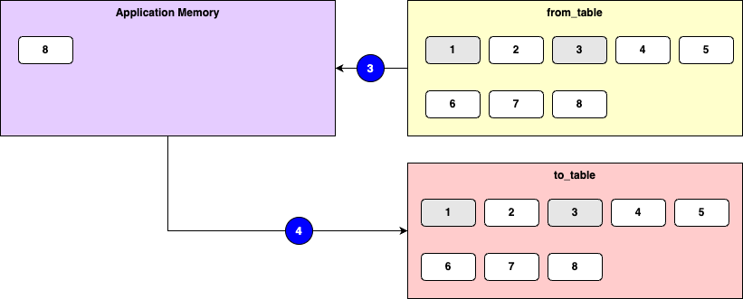

# System Foxtrot

Prerequisites

- 2-Tier: https://github.com/jvalentino/sys-alpha-bravo
- 2-Tier with Load Balancing: https://github.com/jvalentino/sys-charlie
- 2-Tier with Load Balancing and Database Clustering: https://github.com/jvalentino/sys-delta
- 3-Tier
  - Architecture: https://github.com/jvalentino/sys-foxtrot
  - Backend: https://github.com/jvalentino/sys-foxtrot-rest
  - Front-end: https://github.com/jvalentino/sys-foxtrot-ui
  - ETL: https://github.com/jvalentino/sys-foxtrot-etl

This is an example system that it used to demonstrate different architectural approaches as they relate to scalability. Its core functions are the following:

- The system shall allow a user to add documents
- The system shall version documents
- The system shall allow a user to download a document

This specific implementation uses a 3-tier architecture, where:

- The front-end has been broken into its own independent application is separately load balanced.
- The backend is load balancer
- The database is clustered
- There is a separate database cluster that functions as long-term storage (data warehousing)
- There is an additional backend that is used for handling managing the data warehouse

## Previous System

**3-Tier Database Cluster (Rating: a thousand)**

Before jumping off into higher load ratings, it is important to understand the realization that front-end was best to be separated from backend, giving us what we commonly call 3-tier. Instead of relying on the single backend to do everything, we started buidling standalone Javascript based front-end to dynamically render content asynchronously, and only calling the backend when needed. Contunuing on the current path, that makes our last example now look like this:

[](https://github.com/jvalentino/clothes-closet-wiki/blob/main/wiki/step-5.png)

Pros

- Backend and Database independent, allowing us have different optimized servers.
- Multple backends allows us to handle more load from users.
- A database cluster removes the database from being the solo bottlekneck.
- Session is maintained in the database, taking it out of memory.
- Separation between backend and frontend allows for slightly more load.

Cons

- Incentivizes a snowflake architecture by having to fine tune the server hardware differently.
- You are paying for that second instance even when you don't need it.
- The more data that goes into the database, the slower it performs.
- The addition of database land tripled the budget in hardware costs.
- Core reliance on RDMS limits upper scalability.

## Current System

**Data warehousing (Rating: a thousand consistently)**

A common problem that systems eventually run into given enough time, is that the more data stored in their system, the slower the systems perform. This is basically Relational Databases are not infinitely horizontally scalable. This had lead to what we call data warehousing. This is where the core system generally only contains data relevant to some time window (in years) relative to current, and a specialized database cluster is created for the purpose of historial inquiry. This is also the "big data" problem, which has its own solutions, but it is important to understand where it started.

[](https://github.com/jvalentino/clothes-closet-wiki/blob/main/wiki/step-6.png)

Pros

- Backend and Database independent, allowing us have different optimized servers.
- Multple backends allows us to handle more load from users.
- A database cluster removes the database from being the solo bottlekneck.
- Session is maintained in the database, taking it out of memory.
- Separation between backend and frontend allows for slightly more load.
- Data is continually and selectively pruned from the system to mitigate sizing issues.

Cons

- Incentivizes a snowflake architecture by having to fine tune the server hardware differently.
- You are paying for that second instance even when you don't need it.
- The addition of database land tripled the budget in hardware costs.
- You had to double your budget again by adding a data warehouse.
- Usage of the data warehouse required specialized tools and knowledge.
- Core reliance on RDMS limits upper scalability.

# Architecture


## Running the System

### (1) Build it

The following command handle running the builds for the front-end (../sys-foxtrot-ui), backend (../sys-foxtrot-rest), and ETL (../sys-foxtrot-etl):

```bash
./gradlew build
```

The build process has enough steps in it, specifically later with data export and population, that I switched from Bash scripting to using Gradle.

### (2) Run It

The following command launches all the containers:

```bash
> docker compose up -d

[+] Running 13/13
 ⠿ Container foxtrot-secondary-pg-0    Started                                                                                                                                                                      1.8s
 ⠿ Container foxtrot-primary-pg-1      Started                                                                                                                                                                      1.7s
 ⠿ Container foxtrot-frontend-1        Started                                                                                                                                                                      1.8s
 ⠿ Container foxtrot-frontend-2        Started                                                                                                                                                                      1.8s
 ⠿ Container foxtrot-secondary-pg-1    Started                                                                                                                                                                      1.9s
 ⠿ Container foxtrot-primary-pg-0      Started                                                                                                                                                                      1.9s
 ⠿ Container foxtrot-primary-pgpool    Started                                                                                                                                                                      1.7s
 ⠿ Container foxtrot-secondary-pgpool  Started                                                                                                                                                                      1.7s
 ⠿ Container foxtrot-frontend-lb       Started                                                                                                                                                                      2.5s
 ⠿ Container foxtrot-backend-1         Started                                                                                                                                                                      2.6s
 ⠿ Container foxtrot-etl-1             Started                                                                                                                                                                      2.8s
 ⠿ Container foxtrot-backend-2         Started                                                                                                                                                                      2.8s
 ⠿ Container foxtrot-backend-lb        Started  
```

Docker Desktop will then show all the running containers:


The backend instances are on a pause to make sure the database is running before they start, so it is best to check their logs:


The same goes for the ETL:


### (3) Populate it

The following command will populate the primary database and then wipe the data warehouse:

```bash
./gradlew loadMainDb deleteWarehouseDb
```

DbUnit is used to populate using XML files, specifically one for the primary database containing 1 user, 3 Docs, and 4 DocVersions:

**config/dbunit/db.xml**


**config/dbunit/db-dw.xml**

```xml
<?xml version='1.0' encoding='UTF-8'?>
<dataset>
  <auth_user/>
  <batch_run />
  <doc/>
  <doc_task/>
  <doc_version/>
</dataset>
```

**Starting State**


**Ending State**

The ETL application runs every minute, so when it runs for the first time it will do this:


This is because the ETL will copy all of the data (if it has changed), and then delete anything over a year old. Consider that it is also standard for there to be some sort of data transformation as a part of this as well.

## Front-end Land

### frontend-1

This is yet another nginx web server, but this time we have installed our built ReactJS application to its root html directory, and exposed it locally so you can get to it directly using [http://localhost:3000](http://localhost:3000/).

[](https://github.com/jvalentino/sys-echo-rest/blob/main/wiki/3000.png)

### frontend-2

This is yet another nginx web server, but this time we have installed our built ReactJS application to its root html directory, and exposed it locally so you can get to it directly using [http://localhost:4000](http://localhost:4000/).

[](https://github.com/jvalentino/sys-echo-rest/blob/main/wiki/4000.png)

### nginx-frontend-lb

This is the load balancer specific to the front-end. This is running nginx, but instead of as a standard web server it is acting as a load balancer. It is exposed locally on port 80, so when you go to [http://localhost](http://localhost/) it will forward behind the scenes to one of the two ReactJS instances.

[](https://github.com/jvalentino/sys-echo-rest/blob/main/wiki/80.png)

## Backend Land

### backend-1

This is executing the Spring Boot jar file within an OpenJDK container, which runs an embedded web server on port 8080. This port is mapped locally to 8000, so that we can view it directly via our web browser. This is because by default http://localhost:8000/ is the home landing service with no security:

[](https://github.com/jvalentino/sys-echo-rest/blob/main/wiki/8000.png)

### backend-2

This is executing the Spring Boot jar file within an OpenJDK container, which runs an embedded web server on port 8080. This port is mapped locally to 9000, so that we can view it directly via our web browser. This is because by default http://localhost:9000/ is the home landing service with no security:

[](https://github.com/jvalentino/sys-echo-rest/blob/main/wiki/9000.png)

### nginx-backend-lb

This is the load balancer specific to the backend. This is running nginx, but instead of as a standard web server it is acting as a load balancer. It is exposed locally on port 8080, so when you go to [http://localhost:8080](http://localhost:8080/) it will forward behind the scenes to one of the two Spring Boot instances.

[](https://github.com/jvalentino/sys-echo-rest/blob/main/wiki/8080.png)

## Database Land

### primary-pgpool

https://pgpool.net/mediawiki/index.php/Main_Page

This is the endpoint that is used for the database, which then handles directing between multiple instances.

This allows you to connect to it using pgadmin for example, though it directs to the appropriate instance.

[](https://github.com/jvalentino/sys-charlie/blob/main/wiki/pgadmin.png)

Due to load balancing, there is now a schema for keeping track of the cluster health:

[](https://github.com/jvalentino/sys-delta/blob/main/wiki/pgpool.png)

### primary-pg-0

Uses the base image of bitnami/postgresql-repmgr:14, which is a Postgres instance intended to be a part of a cluster.

### primary-pg-1

Uses the base image of bitnami/postgresql-repmgr:14, which is a Postgres instance intended to be a part of a cluster.

## Data Warehousing Land

### etl-1

This is where the new magic happens. There are a lot of ways to do this, and in my case I made a standalone application that runs on a schedule. With it is executed it handles first pulling over any data that has changed (in groups that can fit in memory), and then finally by clearing old data out of primary database.

It can be reached at http://localhost:8081, where I put up a general status page:


#### Data Warehousing Theory

Our primary database is not infinitely scalable, and the more data it has, the slower it will eventually become. As a result, we consider that not all data is needed at all times from a user perspective, so the theory is that we can offload the data that is not likely needed somewhere else. There is also the fact that reporting operations can become intensive, and slow down performance overall, so having a database separate from what the end user is functioning with, allows us to not impact their performance. 

An important consideration is that the warehousing database is not a 1:1 representation, as we are likely to have to transform data in order to optimize reporting against it. Some data will be a straight copy, while others will require some sort of transformation. This means we can't just turn on replication and walk away. So how do we handle copying and transforming potentially massive amounts of data?

#### Schema Insertion Order


When populating any database, there is an order, and figuring out that order is the first step. For small schemas just draw arrows to indicate relationships, and the this makes it relatively easy to see the insertion order. For larger schema, consider that relationships are a directed acyclic graph, and you can use an algorithm (https://en.wikipedia.org/wiki/Dijkstra%27s_algorithm) to automate figuring it out. In cases where there are loops dependencies, you will have to set one to null and then come back at the end and handle them.

#### Data Batching

This is where keeping track of when every record was updated comes in handy. We only need to pul records for a given table that where changed since the last time we did this. In this example, only records 2, 4, 5, 6, 7, and 8 have are new or have been changed:


Since we can't always pull every single record into application memory, we have to pull records in a group using pagination in whatever our technology is. In this example, we are pulling records in groups of 5:


This process is repeated until all the records (that have been updated) have been dealt with:




### secondary-pgpool

This is the same thing as the primary database, except running on port 5433 and with a slightly different schema.


### secondary-pg-0

Uses the base image of bitnami/postgresql-repmgr:14, which is a Postgres instance intended to be a part of a cluster.

### secondary-pg-1

Uses the base image of bitnami/postgresql-repmgr:14, which is a Postgres instance intended to be a part of a cluster.


